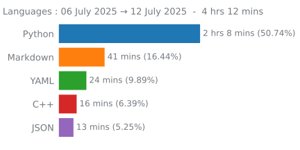

# WakaDash

**WakaDash** - a tool that fetches your weekly [WakaTime](https://wakatime.com/) coding statistics and generates a clean horizontal bar chart (`lang_stats.svg`). You can embed this visual breakdown anywhere - from your GitHub profile README to a personal portfolio.


<p align="center">
  
</p>


##  Use This in Your Own Profile (Fork & Go!) 🍴

You can use WakaDash to show your own coding activity by just forking this repo and connecting your WakaTime account. Here's how:


### Step 1: Create a Waktime account 
Go to [WakaTime](https://wakatime.com/), create your account and get your API Key.

### Step 2:  Fork This Repo

Click the "Fork" button in the top right of this page and fork it to your account.

### Step 3: Add Your WakaTime API Key as a Secret
1. Go to your forked repo’s `Settings` → `Secrets and variables` → `Actions` → `New repository secret`

2. Name the secret exactly: **`WAKATIME_API_KEY`**

3. Paste your WakaTime API Key 

###  Step 4: Enable GitHub Actions
1. Go to the `Actions` tab in your forked repo

2. Enable workflows if prompted

3. The action will now run automatically once per day, and generate a new lang_stats.svg


### Step 5: Show It in Your GitHub Profile

In your Profile `Readme.md`, paste this:

Replace `<your-username>` with your user-name.

```md


```

✅ That's it! Every day your chart will auto-update with your latest WakaTime stats.

